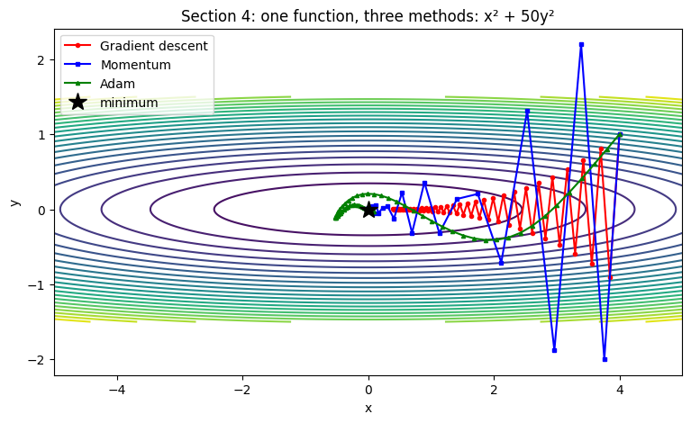
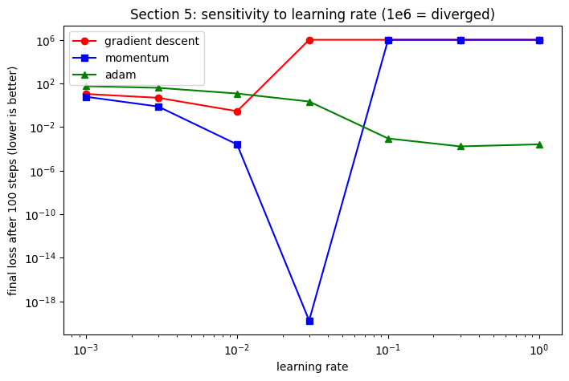
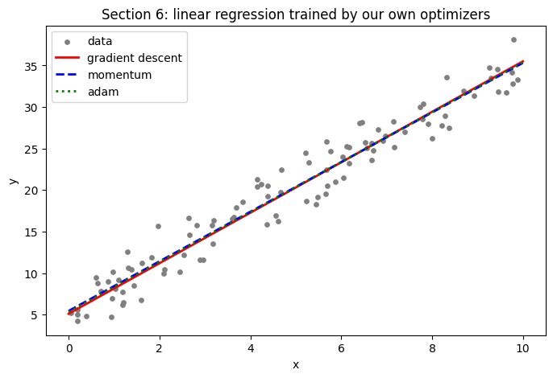

# Optimizer Visualizer

Gradient descent, Momentum and Adam implemented **from scratch in NumPy**, then compared visually and used to train a real model.

**Notebook:** [optimizer_visualizer.ipynb](optimizer_visualizer.ipynb) (runs in Google Colab, no setup needed)

## What this project does
- Implements three optimizers using only NumPy, with no ML libraries.
- Visualizes how each one travels down a narrow valley f(x, y) = x² + 50y².
- Tests how sensitive each optimizer is to the learning rate.
- Uses them to train linear regression and checks the result against the exact least-squares solution.

## Results

### 1. Paths on a narrow valley

Plain gradient descent zig-zags across the steep direction and crawls along the valley. Momentum smooths the path and gets much closer to the minimum in the same number of steps.

### 2. Sensitivity to learning rate

| Learning rate | Gradient descent | Momentum | Adam |
|---|---|---|---|
| 0.001 | 10.7 | 5.9 | 55.9 |
| 0.01 | 0.28 | 0.00025 | 11.8 |
| 0.03 | diverged | ~0 | 2.2 |
| 0.1 | diverged | diverged | 0.00089 |
| 1.0 | diverged | diverged | 0.00026 |

*(final loss after 100 steps, lower is better)*

Momentum was the best when tuned well, but Adam was the only optimizer that kept working across learning rates from 0.1 to 1.0.

### 3. Linear regression trained with my own optimizers

| Method | w | b |
|---|---|---|
| True line used to generate data | 3.000 | 5.000 |
| Exact least squares (NumPy) | 2.987 | 5.444 |
| Momentum (mine) | 2.987 | 5.444 |
| Adam (mine) | 3.007 | 5.323 |
| Gradient descent (mine) | 3.041 | 5.102 |

My from-scratch Momentum matches the exact solution to three decimals.

## What I learned
- Why plain gradient descent struggles on narrow valleys, and how momentum fixes it.
- Why Adam is popular: it is robust to a badly chosen learning rate.
- That a well-tuned simple method can beat a more complex one, so it is worth checking instead of assuming.

## How to run
Open `optimizer_visualizer.ipynb` in Google Colab and choose **Runtime → Run all**.

## Tech
Python, NumPy, Matplotlib
